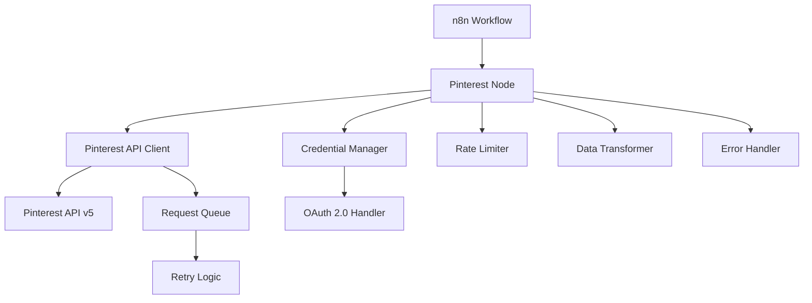

# Pinterest Node for n8n - Design Document

## Overview

The Pinterest node for n8n will be implemented as a community node package that integrates with Pinterest API v5 to provide comprehensive Pinterest functionality within n8n workflows. The node will support OAuth 2.0 authentication, complete CRUD operations for pins and boards, media upload capabilities, analytics access, and search functionality.

The design follows n8n's established patterns for community nodes, utilizing TypeScript for type safety, and implementing proper error handling, rate limiting, and security measures to ensure reliable operation within the n8n ecosystem.

## Architecture

### High-Level Architecture



### Core Components

1. **Pinterest Node Class** - Main node implementation following n8n INodeType interface
2. **Pinterest Credentials** - OAuth 2.0 credential management for Pinterest authentication
3. **Pinterest API Client** - Abstraction layer for Pinterest API interactions
4. **Operation Handlers** - Specific handlers for different Pinterest operations
5. **Data Transformers** - Input/output data mapping and validation
6. **Rate Limiter** - Pinterest API rate limit compliance
7. **Error Handler** - Comprehensive error handling and user feedback

### Project Structure

```
n8n-nodes-pinterest/
├── credentials/
│   └── PinterestOAuth2Api.credentials.ts
├── nodes/
│   └── Pinterest/
│       ├── Pinterest.node.ts
│       ├── PinterestDescription.ts
│       ├── operations/
│       │   ├── pin/
│       │   │   ├── create.operation.ts
│       │   │   ├── get.operation.ts
│       │   │   ├── update.operation.ts
│       │   │   ├── delete.operation.ts
│       │   │   └── index.ts
│       │   ├── board/
│       │   │   ├── create.operation.ts
│       │   │   ├── get.operation.ts
│       │   │   ├── update.operation.ts
│       │   │   ├── delete.operation.ts
│       │   │   └── index.ts
│       │   ├── user/
│       │   │   ├── profile.operation.ts
│       │   │   ├── analytics.operation.ts
│       │   │   └── index.ts
│       │   └── search/
│       │       ├── pins.operation.ts
│       │       ├── boards.operation.ts
│       │       └── index.ts
│       ├── utils/
│       │   ├── PinterestApiClient.ts
│       │   ├── RateLimiter.ts
│       │   ├── DataTransformer.ts
│       │   ├── ErrorHandler.ts
│       │   └── types.ts
│       └── pinterest.svg
├── package.json
├── tsconfig.json
└── README.md
```

## Components and Interfaces

### Pinterest Node Class

The main node class implements the n8n INodeType interface and serves as the entry point for all Pinterest operations.

```typescript
export class Pinterest implements INodeType {
  description: INodeTypeDescription = {
    displayName: 'Pinterest',
    name: 'pinterest',
    icon: { light: 'file:pinterest.svg', dark: 'file:pinterest.svg' },
    group: ['transform'],
    version: 1,
    subtitle: '={{$parameter["operation"] + ": " + $parameter["resource"]}}',
    description: 'Interact with Pinterest API v5',
    defaults: {
      name: 'Pinterest',
    },
    inputs: [NodeConnectionType.Main],
    outputs: [NodeConnectionType.Main],
    credentials: [
      {
        name: 'pinterestOAuth2Api',
        required: true,
      },
    ],
    requestDefaults: {
      baseURL: 'https://api.pinterest.com/v5',
      headers: {
        Accept: 'application/json',
        'Content-Type': 'application/json',
      },
    },
    properties: [
      // Resource and operation selection
      // Dynamic fields based on selected operation
    ],
  };

  async execute(this: IExecuteFunctions): Promise<INodeExecutionData[][]> {
    // Main execution logic
  }
}
```

### Pinterest OAuth 2.0 Credentials

Implements Pinterest's OAuth 2.0 authentication flow with PKCE support.

```typescript
export class PinterestOAuth2Api implements ICredentialType {
  name = 'pinterestOAuth2Api';
  displayName = 'Pinterest OAuth2 API';
  documentationUrl = 'https://developers.pinterest.com/docs/getting-started/authentication/';
  icon = { light: 'file:pinterest.svg', dark: 'file:pinterest.svg' };

  properties: INodeProperties[] = [
    {
      displayName: 'Grant Type',
      name: 'grantType',
      type: 'hidden',
      default: 'authorizationCode',
    },
    {
      displayName: 'Authorization URL',
      name: 'authUrl',
      type: 'hidden',
      default: 'https://www.pinterest.com/oauth/',
    },
    {
      displayName: 'Access Token URL',
      name: 'accessTokenUrl',
      type: 'hidden',
      default: 'https://api.pinterest.com/v5/oauth/token',
    },
    {
      displayName: 'Client ID',
      name: 'clientId',
      type: 'string',
      required: true,
      default: '',
    },
    {
      displayName: 'Client Secret',
      name: 'clientSecret',
      type: 'string',
      typeOptions: { password: true },
      required: true,
      default: '',
    },
    {
      displayName: 'Scope',
      name: 'scope',
      type: 'hidden',
      default: 'user_accounts:read,boards:read,boards:write,boards:read_secret,boards:write_secret,pins:read,pins:write,pins:read_secret,pins:write_secret',
    },
    {
      displayName: 'Use Continuous Refresh',
      name: 'continuousRefresh',
      type: 'boolean',
      default: true,
      description: 'Use continuous refresh tokens (60-day expiration, recommended). Legacy tokens will be deprecated September 25, 2025.',
    },
  ];

  authenticate: IAuthenticateGeneric = {
    type: 'oauth2',
    properties: {
      tokenType: 'Bearer',
    },
  };

  test: ICredentialTestRequest = {
    request: {
      baseURL: 'https://api.pinterest.com/v5',
      url: '/user_account',
    },
  };
}
```

### Pinterest API Client

Centralized API client handling all Pinterest API interactions with rate limiting and error handling.

```typescript
export class PinterestApiClient {
  private rateLimiter: RateLimiter;
  private errorHandler: ErrorHandler;

  constructor(
    private credentials: ICredentialDataDecryptedObject,
    private helpers: IHttpRequestHelper
  ) {
    this.rateLimiter = new RateLimiter();
    this.errorHandler = new ErrorHandler();
  }

  async makeRequest<T>(
    method: string,
    endpoint: string,
    data?: any,
    options?: IRequestOptions
  ): Promise<T> {
    await this.rateLimiter.checkLimit();
    
    try {
      const response = await this.helpers.httpRequestWithAuthentication.call(
        this,
        'pinterestOAuth2Api',
        {
          method,
          url: endpoint,
          body: data,
          ...options,
        }
      );
      
      this.rateLimiter.updateFromHeaders(response.headers);
      return response;
    } catch (error) {
      throw this.errorHandler.handleApiError(error);
    }
  }

  // Specific API methods
  async createPin(pinData: CreatePinRequest): Promise<PinResponse> {
    return this.makeRequest('POST', '/pins', pinData);
  }

  async getPin(pinId: string): Promise<PinResponse> {
    return this.makeRequest('GET', `/pins/${pinId}`);
  }

  async updatePin(pinId: string, updateData: UpdatePinRequest): Promise<PinResponse> {
    return this.makeRequest('PATCH', `/pins/${pinId}`, updateData);
  }

  async deletePin(pinId: string): Promise<void> {
    return this.makeRequest('DELETE', `/pins/${pinId}`);
  }

  // Board operations
  async createBoard(boardData: CreateBoardRequest): Promise<BoardResponse> {
    return this.makeRequest('POST', '/boards', boardData);
  }

  async getBoard(boardId: string): Promise<BoardResponse> {
    return this.makeRequest('GET', `/boards/${boardId}`);
  }

  // Media upload
  async uploadMedia(mediaData: MediaUploadRequest): Promise<MediaResponse> {
    return this.makeRequest('POST', '/media', mediaData, {
      headers: { 'Content-Type': 'multipart/form-data' },
    });
  }

  // User operations
  async getUserProfile(): Promise<UserProfileResponse> {
    return this.makeRequest('GET', '/user_account');
  }

  // Analytics
  async getPinAnalytics(pinId: string, params?: AnalyticsParams): Promise<AnalyticsResponse> {
    const queryString = params ? `?${new URLSearchParams(params).toString()}` : '';
    return this.makeRequest('GET', `/pins/${pinId}/analytics${queryString}`);
  }

  // Search operations
  async searchPins(query: string, params?: SearchParams): Promise<SearchResponse> {
    const searchParams = new URLSearchParams({ query, ...params });
    return this.makeRequest('GET', `/search/pins?${searchParams.toString()}`);
  }
}
```

### Rate Limiter

Implements Pinterest API rate limiting compliance with intelligent queuing.

```typescript
export class RateLimiter {
  private requestCount = 0;
  private resetTime = 0;
  private readonly maxRequests = 1000; // Pinterest limit: 1000/hour
  private readonly windowMs = 60 * 60 * 1000; // 1 hour

  async checkLimit(): Promise<void> {
    const now = Date.now();
    
    if (now > this.resetTime) {
      this.requestCount = 0;
      this.resetTime = now + this.windowMs;
    }

    if (this.requestCount >= this.maxRequests * 0.9) { // 90% threshold
      const waitTime = this.resetTime - now;
      if (waitTime > 0) {
        await this.sleep(waitTime);
      }
    }

    this.requestCount++;
  }

  updateFromHeaders(headers: any): void {
    const remaining = parseInt(headers['x-ratelimit-remaining'] || '0');
    const reset = parseInt(headers['x-ratelimit-reset'] || '0');
    
    if (remaining !== undefined) {
      this.requestCount = this.maxRequests - remaining;
    }
    
    if (reset !== undefined) {
      this.resetTime = reset * 1000; // Convert to milliseconds
    }
  }

  private sleep(ms: number): Promise<void> {
    return new Promise(resolve => setTimeout(resolve, ms));
  }
}
```

### Operation Handlers

Each Pinterest operation is implemented as a separate handler for maintainability and testability.

```typescript
// Pin Create Operation
export async function createPin(
  this: IExecuteFunctions,
  apiClient: PinterestApiClient,
  itemIndex: number
): Promise<INodeExecutionData> {
  const boardId = this.getNodeParameter('boardId', itemIndex) as string;
  const mediaSource = this.getNodeParameter('mediaSource', itemIndex) as string;
  const title = this.getNodeParameter('title', itemIndex, '') as string;
  const description = this.getNodeParameter('description', itemIndex, '') as string;
  const link = this.getNodeParameter('link', itemIndex, '') as string;
  const altText = this.getNodeParameter('altText', itemIndex, '') as string;

  // Validate required fields
  if (!boardId) {
    throw new NodeOperationError(this.getNode(), 'Board ID is required');
  }

  // Handle media upload if needed
  let mediaId: string | undefined;
  if (mediaSource === 'upload') {
    const mediaFile = this.getNodeParameter('mediaFile', itemIndex) as IDataObject;
    const uploadResponse = await apiClient.uploadMedia({
      media_type: 'image',
      file: mediaFile,
    });
    mediaId = uploadResponse.media_id;
  }

  // Create pin
  const pinData: CreatePinRequest = {
    board_id: boardId,
    media_source: {
      source_type: mediaSource === 'upload' ? 'image_upload' : 'image_url',
      url: mediaSource === 'url' ? this.getNodeParameter('mediaUrl', itemIndex) as string : undefined,
      media_id: mediaId,
    },
    title,
    description,
    link,
    alt_text: altText,
  };

  const response = await apiClient.createPin(pinData);
  
  return {
    json: DataTransformer.transformPinResponse(response),
    pairedItem: { item: itemIndex },
  };
}
```

## Data Models

### Core Data Types

```typescript
// Pinterest API Request Types
export interface CreatePinRequest {
  board_id: string;
  media_source: {
    source_type: 'image_url' | 'video_url' | 'image_upload';
    url?: string;
    media_id?: string;
  };
  description?: string;
  link?: string;
  title?: string;
  alt_text?: string;
}

export interface CreateBoardRequest {
  name: string;
  description?: string;
  privacy: 'public' | 'protected' | 'secret';
}

export interface MediaUploadRequest {
  media_type: 'image' | 'video';
  file: Buffer | File;
}

// Pinterest API Response Types
export interface PinResponse {
  id: string;
  created_at: string;
  url: string;
  title?: string;
  description?: string;
  link?: string;
  board_id: string;
  media: {
    url: string;
    media_type: string;
  };
}

export interface BoardResponse {
  id: string;
  name: string;
  description?: string;
  created_at: string;
  url: string;
  privacy: string;
  pin_count: number;
  follower_count: number;
}

export interface UserProfileResponse {
  username: string;
  id: string;
  first_name: string;
  last_name: string;
  display_name: string;
  bio: string;
  avatar_url: string;
  account_type: 'personal' | 'business';
}

// n8n Node Parameter Types
export interface PinCreateParams {
  boardId: string;
  mediaSource: 'url' | 'upload';
  mediaUrl?: string;
  mediaFile?: IDataObject;
  title?: string;
  description?: string;
  link?: string;
  altText?: string;
}

export interface BoardCreateParams {
  name: string;
  description?: string;
  privacy: 'public' | 'protected' | 'secret';
}
```

### Data Transformation

```typescript
export class DataTransformer {
  static transformPinResponse(pin: PinResponse): IDataObject {
    return {
      pinId: pin.id,
      url: pin.url,
      title: pin.title,
      description: pin.description,
      link: pin.link,
      boardId: pin.board_id,
      createdAt: pin.created_at,
      mediaUrl: pin.media?.url,
      mediaType: pin.media?.media_type,
    };
  }

  static transformBoardResponse(board: BoardResponse): IDataObject {
    return {
      boardId: board.id,
      name: board.name,
      description: board.description,
      url: board.url,
      privacy: board.privacy,
      pinCount: board.pin_count,
      followerCount: board.follower_count,
      createdAt: board.created_at,
    };
  }

  static transformUserProfile(user: UserProfileResponse): IDataObject {
    return {
      userId: user.id,
      username: user.username,
      displayName: user.display_name,
      firstName: user.first_name,
      lastName: user.last_name,
      bio: user.bio,
      avatarUrl: user.avatar_url,
      accountType: user.account_type,
    };
  }
}
```

## Error Handling

### Error Classification and Handling

```typescript
export class ErrorHandler {
  handleApiError(error: any): NodeApiError {
    const statusCode = error.response?.status || 500;
    const errorData = error.response?.data || {};

    switch (statusCode) {
      case 400:
        return new NodeApiError(this.getNode(), {
          message: 'Bad Request: ' + (errorData.message || 'Invalid request parameters'),
          description: this.getErrorDescription(errorData),
          httpCode: '400',
        });

      case 401:
        return new NodeApiError(this.getNode(), {
          message: 'Authentication failed: Please check your Pinterest credentials',
          description: 'Your access token may have expired. Try reconnecting your Pinterest account.',
          httpCode: '401',
        });

      case 403:
        return new NodeApiError(this.getNode(), {
          message: 'Forbidden: Insufficient permissions',
          description: 'Your Pinterest account may not have the required permissions for this operation.',
          httpCode: '403',
        });

      case 404:
        return new NodeApiError(this.getNode(), {
          message: 'Not Found: ' + (errorData.message || 'The requested resource was not found'),
          description: 'Please verify that the pin ID, board ID, or other identifiers are correct.',
          httpCode: '404',
        });

      case 429:
        return new NodeApiError(this.getNode(), {
          message: 'Rate limit exceeded',
          description: 'Pinterest API rate limit has been exceeded. Please wait before making more requests.',
          httpCode: '429',
        });

      case 500:
      case 502:
      case 503:
        return new NodeApiError(this.getNode(), {
          message: 'Pinterest API server error',
          description: 'Pinterest is experiencing technical difficulties. Please try again later.',
          httpCode: statusCode.toString(),
        });

      default:
        return new NodeApiError(this.getNode(), {
          message: 'Unknown error occurred',
          description: errorData.message || 'An unexpected error occurred while communicating with Pinterest.',
          httpCode: statusCode.toString(),
        });
    }
  }

  private getErrorDescription(errorData: any): string {
    if (errorData.details && Array.isArray(errorData.details)) {
      return errorData.details
        .map((detail: any) => `${detail.field}: ${detail.reason}`)
        .join(', ');
    }
    return errorData.message || 'Please check your input parameters and try again.';
  }
}
```

## Testing Strategy

### Unit Testing Structure

```typescript
// Test structure for Pinterest operations
describe('Pinterest Node', () => {
  describe('Pin Operations', () => {
    describe('Create Pin', () => {
      it('should create pin with valid data', async () => {
        // Test implementation
      });

      it('should handle media upload', async () => {
        // Test media upload functionality
      });

      it('should validate required fields', async () => {
        // Test validation logic
      });
    });

    describe('Get Pin', () => {
      it('should retrieve pin by ID', async () => {
        // Test pin retrieval
      });

      it('should handle non-existent pin', async () => {
        // Test error handling
      });
    });
  });

  describe('Authentication', () => {
    it('should authenticate with valid credentials', async () => {
      // Test OAuth flow
    });

    it('should handle token refresh', async () => {
      // Test token refresh logic
    });
  });

  describe('Rate Limiting', () => {
    it('should respect rate limits', async () => {
      // Test rate limiting compliance
    });

    it('should queue requests when limit exceeded', async () => {
      // Test request queuing
    });
  });
});
```

### Integration Testing

- Pinterest API sandbox integration
- n8n workflow execution testing
- Cross-node data flow validation
- Error scenario testing
- Performance benchmarking

### Test Data Management

- Mock Pinterest API responses
- Test media files for upload testing
- Sample workflow configurations
- Error condition simulations

This design provides a comprehensive foundation for implementing the Pinterest node with proper separation of concerns, robust error handling, and adherence to n8n development best practices.
